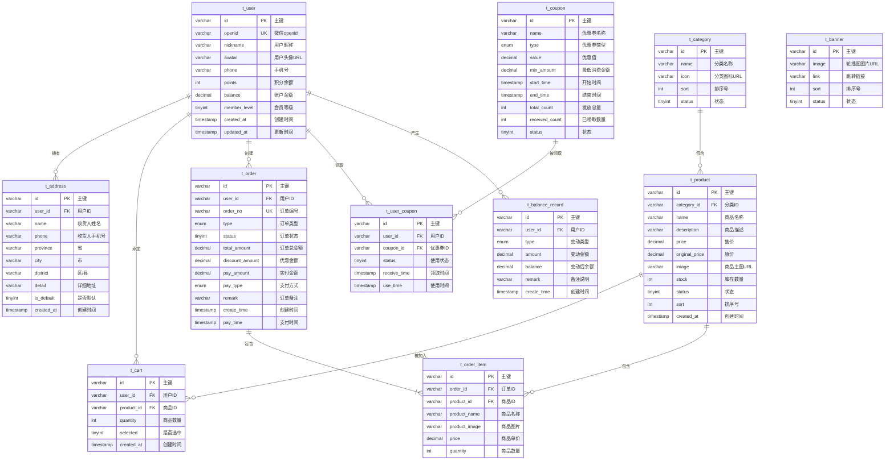

# 数据库 ER 图

## 实体关系图



## 表关系说明

### 1. 用户模块关系

| 主表 | 从表 | 关系类型 | 说明 |
|------|------|----------|------|
| t_user | t_address | 1:N | 一个用户可以拥有多个收货地址 |
| t_user | t_cart | 1:N | 一个用户可以添加多个商品到购物车 |
| t_user | t_order | 1:N | 一个用户可以创建多个订单 |
| t_user | t_user_coupon | 1:N | 一个用户可以领取多张优惠券 |
| t_user | t_balance_record | 1:N | 一个用户可以产生多条余额记录 |

### 2. 商品模块关系

| 主表 | 从表 | 关系类型 | 说明 |
|------|------|----------|------|
| t_category | t_product | 1:N | 一个分类可以包含多个商品 |
| t_product | t_cart | 1:N | 一个商品可以被多个用户加入购物车 |
| t_product | t_order_item | 1:N | 一个商品可以出现在多个订单中 |

### 3. 订单模块关系

| 主表 | 从表 | 关系类型 | 说明 |
|------|------|----------|------|
| t_order | t_order_item | 1:N | 一个订单可以包含多个商品项 |

### 4. 营销模块关系

| 主表 | 从表 | 关系类型 | 说明 |
|------|------|----------|------|
| t_coupon | t_user_coupon | 1:N | 一张优惠券可以被多个用户领取 |

## 关联字段汇总

| 从表 | 外键字段 | 关联主表 | 主表字段 |
|------|----------|----------|----------|
| t_address | user_id | t_user | id |
| t_product | category_id | t_category | id |
| t_cart | user_id | t_user | id |
| t_cart | product_id | t_product | id |
| t_order | user_id | t_user | id |
| t_order_item | order_id | t_order | id |
| t_order_item | product_id | t_product | id |
| t_user_coupon | user_id | t_user | id |
| t_user_coupon | coupon_id | t_coupon | id |
| t_balance_record | user_id | t_user | id |

## 模块划分

```
┌─────────────────────────────────────────────────────────────┐
│                         用户模块                             │
│  ┌─────────┐    ┌───────────┐    ┌─────────────────────┐   │
│  │ t_user  │───<│ t_address │    │ t_balance_record    │   │
│  └────┬────┘    └───────────┘    └─────────────────────┘   │
│       │                                                      │
│       │    ┌───────────┐    ┌─────────────┐                 │
│       └───<│ t_cart    │    │ t_user_coupon│                │
│            └─────┬─────┘    └──────┬──────┘                │
│                  │                 │                        │
└──────────────────┼─────────────────┼────────────────────────┘
                   │                 │
┌──────────────────┼─────────────────┼────────────────────────┐
│                  │                 │      营销模块          │
│  商品模块         │                 │  ┌───────────┐        │
│  ┌───────────┐   │                 └─>│ t_coupon  │        │
│  │t_category │───┘                    └───────────┘        │
│  └─────┬─────┘                                              │
│        │                                                    │
│  ┌─────┴─────┐    ┌─────────────┐                          │
│  │ t_product │───<│ t_order_item│                           │
│  └───────────┘    └──────┬──────┘                          │
│                          │                                 │
│  订单模块                 │                                 │
│  ┌───────────┐           │                                 │
│  │  t_order  │<──────────┘                                 │
│  └───────────┘                                             │
│                                                            │
│  ┌───────────┐                                             │
│  │ t_banner  │                                             │
│  └───────────┘                                             │
└─────────────────────────────────────────────────────────────┘
```

## 图例说明

- **PK**: Primary Key - 主键
- **FK**: Foreign Key - 外键
- **UK**: Unique Key - 唯一键
- **1:N**: 一对多关系
- **N:M**: 多对多关系（通过中间表实现）
