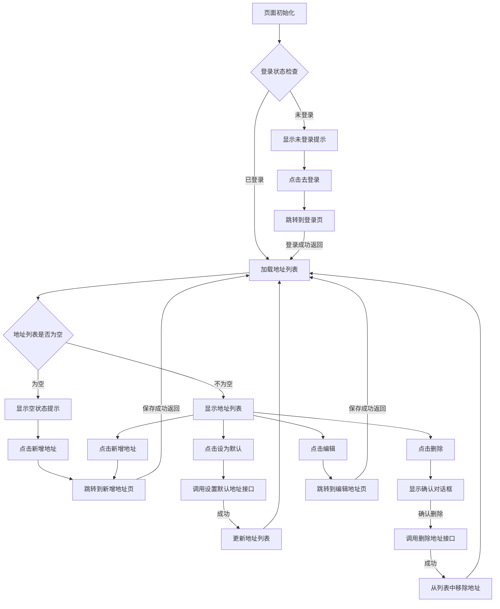

# 地址管理页交互流程说明

## 1. 页面初始化流程

1. **页面加载**：用户进入地址管理页面（pages/address/address）
2. **检查登录状态**：调用 `auth.ts` 中的登录状态检查方法
3. **初始化数据**：
   - 初始化地址列表数据为空数组
   - 初始化加载状态为 true
   - 初始化错误状态为 false
4. **根据登录状态执行后续流程**：
   - 已登录：执行加载地址列表流程
   - 未登录：执行未登录状态处理流程

## 2. 加载地址列表流程

1. **调用地址列表接口**：调用 `services/address.ts` 中的 `getAddressList` 方法
2. **处理加载状态**：显示加载动画或加载提示
3. **获取地址列表**：
   - 成功：更新地址列表数据，隐藏加载状态
   - 失败：显示错误提示，隐藏加载状态
4. **检查地址列表是否为空**：
   - 不为空：显示地址列表
   - 为空：执行空地址列表状态处理流程

## 3. 设置默认地址流程

1. **用户操作**：用户点击地址项中的「设为默认」按钮
2. **调用设置默认地址接口**：调用 `services/address.ts` 中的 `setDefaultAddress` 方法，传入地址 ID
3. **处理加载状态**：显示加载提示
4. **处理接口响应**：
   - 成功：
     - 更新地址列表中默认地址状态
     - 显示操作成功提示
   - 失败：显示操作失败提示
5. **刷新地址列表**：重新调用加载地址列表流程，确保数据一致性

## 4. 删除地址流程

1. **用户操作**：用户点击地址项中的「删除」按钮
2. **显示确认对话框**：弹出确认删除的对话框，提示用户确认操作
3. **用户确认**：用户点击「确认删除」按钮
4. **调用删除地址接口**：调用 `services/address.ts` 中的 `deleteAddress` 方法，传入地址 ID
5. **处理加载状态**：显示加载提示
6. **处理接口响应**：
   - 成功：
     - 从地址列表中移除该地址
     - 显示操作成功提示
     - 检查地址列表是否为空，若为空执行空地址列表状态处理流程
   - 失败：显示操作失败提示

## 5. 跳转到新增地址流程

1. **用户操作**：用户点击页面中的「新增地址」按钮
2. **页面跳转**：跳转到新增地址页面（pages/address/add）
3. **返回处理**：
   - 用户在新增地址页面成功保存地址后返回
   - 自动重新加载地址列表，显示新添加的地址

## 6. 跳转到编辑地址流程

1. **用户操作**：用户点击地址项中的「编辑」按钮
2. **页面跳转**：跳转到编辑地址页面（pages/address/edit），并携带当前地址信息作为参数
3. **返回处理**：
   - 用户在编辑地址页面成功保存修改后返回
   - 自动重新加载地址列表，显示更新后的地址信息

## 7. 未登录状态处理流程

1. **显示未登录提示**：显示「请先登录」的提示信息
2. **提供登录入口**：显示「去登录」按钮
3. **用户操作**：用户点击「去登录」按钮
4. **页面跳转**：跳转到登录页面（pages/login/login）
5. **返回处理**：
   - 用户登录成功后返回地址管理页面
   - 自动执行加载地址列表流程

## 8. 空地址列表状态处理流程

1. **显示空状态提示**：显示「暂无地址」的提示信息
2. **提供新增地址入口**：显示「新增地址」按钮
3. **用户操作**：用户点击「新增地址」按钮
4. **页面跳转**：跳转到新增地址页面（pages/address/add）
5. **返回处理**：
   - 用户在新增地址页面成功保存地址后返回
   - 自动重新加载地址列表，显示新添加的地址

## 9. 相关接口说明

- **获取地址列表**：`services/address.ts` 中的 `getAddressList` 方法
- **设置默认地址**：`services/address.ts` 中的 `setDefaultAddress` 方法
- **删除地址**：`services/address.ts` 中的 `deleteAddress` 方法
- **检查登录状态**：`services/auth.ts` 中的登录状态检查方法

## 10. 页面交互流程图

